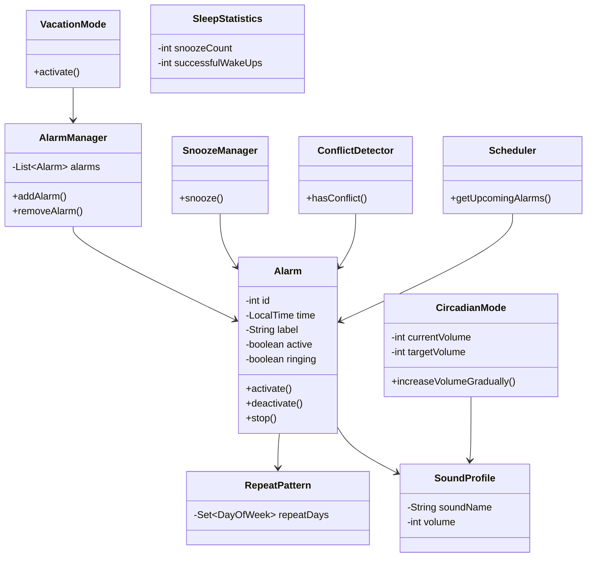

# Diagrama de clases

```mermaid
classDiagram

class Alarm {
    -int id
    -LocalTime time
    -String label
    -boolean active
    -boolean ringing
    +activate()
    +deactivate()
    +stop()
}

class AlarmManager {
    -List~Alarm~ alarms
    +addAlarm()
    +removeAlarm()
}

class RepeatPattern {
    -Set~DayOfWeek~ repeatDays
}

class SoundProfile {
    -String soundName
    -int volume
}

class SnoozeManager {
    +snooze()
}

class ConflictDetector {
    +hasConflict()
}

class VacationMode {
    +activate()
}

class SleepStatistics {
    -int snoozeCount
    -int successfulWakeUps
}

class CircadianMode {
    -int currentVolume
    -int targetVolume
    +increaseVolumeGradually()
}

class Scheduler {
    +getUpcomingAlarms()
}

AlarmManager --> Alarm
Alarm --> RepeatPattern
Alarm --> SoundProfile
SnoozeManager --> Alarm
ConflictDetector --> Alarm
VacationMode --> AlarmManager
Scheduler --> Alarm
CircadianMode --> SoundProfile
```